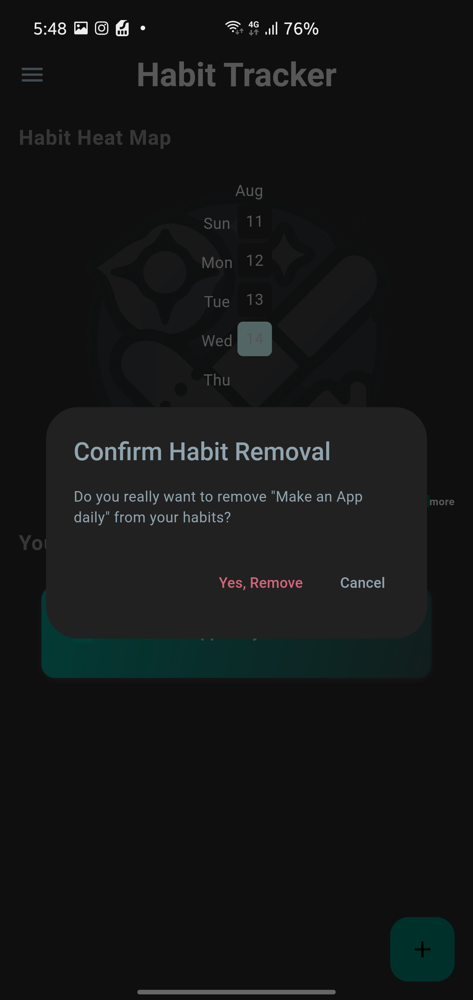
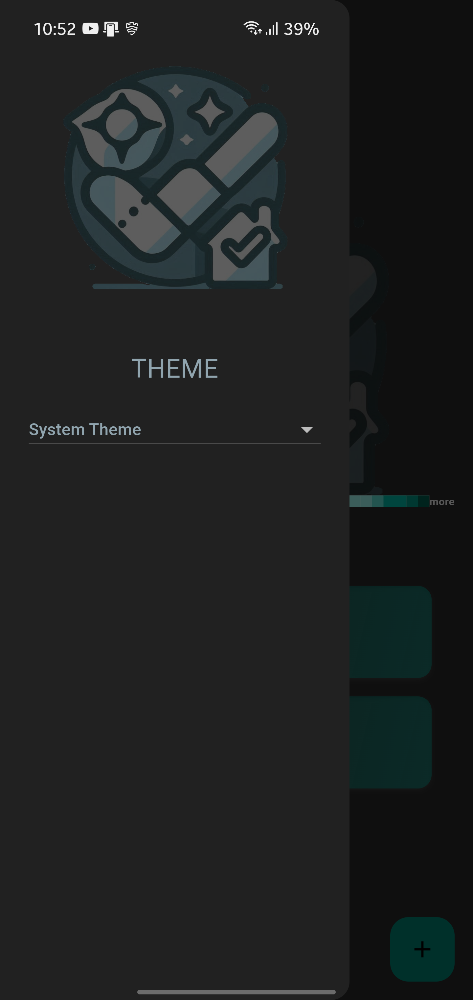

# Habit Sync

Habit Sync is a versatile habit-tracking app designed to help users build and maintain healthy habits. The app provides a user-friendly interface to track daily habits, visualize progress through heat maps, and manage habit-related data efficiently.


## Table of Contents

- [Features](#features)
- [Installation](#installation)
- [Usage](#usage)
- [Configuration](#configuration)
- [Contributing](#contributing)
- [Screenshots](#screenshots)


## Features

- **Create and Manage Habits**: Easily add, edit, and delete habits.
- **Visual Progress Tracking**: View your habit progress through interactive heat maps.
- **Customizable Themes**: Switch between light and dark modes to suit your preference.
- **User-Friendly UI**: Intuitive interface with responsive design for various screen sizes.
- **Data Persistence**: Save and load habit data using local storage.

## Installation

### Prerequisites

- [Flutter](https://flutter.dev/docs/get-started/install) (version 3.10.0 or higher)
- [Dart](https://dart.dev/get-dart)
- Android/iOS Emulator or a physical device


### Clone the Repository

```bash
git clone https://github.com/junii03/habit_sync.git
cd habit_sync
```

### Install Dependencies

```bash
flutter pub get
```

### Run the App

```bash
flutter run
```

## Usage

### Running the App

To start using Habit Sync, simply run the app on your preferred device or emulator using the command:

```bash
flutter run
```

## APK Installation
1. **Download the APK**

   You can download the latest release APK file from the following link:

   [Download Habit Sync APK](https://github.com/junii03/HabitSync/releases/download/beta-release/app-release.apk)

2. **Install the APK**

    - Transfer the APK file to your Android device.
    - Open the file on your device to begin the installation process.
    - Follow the prompts to install the app.

### Creating a New Habit

1. Tap the "+" button on the home screen.
2. Enter the habit name in the dialog that appears.
3. Tap "Save" to add the habit to your list.

### Viewing Progress

- Access the heat map view from the home screen to see your habit progress over time.
- Habits are color-coded based on completion frequency.

### Editing a Habit

1. Locate the habit you want to edit in the list on the home screen.
2. Swipe left on the habit and tap the edit icon to open the edit dialog.
3. Modify the habit name in the dialog that appears.
4. Tap "Save" to update the habit with the new name.

### Deleting a Habit

1. Locate the habit you want to delete in the list on the home screen.
2. Swipe left on the habit and tap the delete icon to open the confirmation dialog.
3. Confirm the deletion by tapping "Yes, Remove" in the dialog.


### Changing Themes

- Use the drawer menu to toggle between light and dark modes.

## Configuration

### Themes

Habit Sync supports both light and dark themes. You can customize the themes by modifying the files in `theme` directory.

### Heat Map Colors

The heat map color scheme can be adjusted in the `my_heat_map.dart` file. Update the `colorsets` property to change color gradients based on habit completion.

## Contributing

I welcome contributions to Habit Sync! To contribute:

1. **Fork the Repository**: Create a fork of the repository on GitHub.
2. **Clone Your Fork**: Clone your fork to your local machine.
3. **Create a Branch**: Create a new branch for your changes.
4. **Make Changes**: Implement your changes or features.
5. **Submit a Pull Request**: Push your branch and submit a pull request to the main repository.


## Screenshots

|  |  |  |
|-------------------------------------------------------------|-----------------------------------------------------------|---------------------------------------------------------------------|
| Light Mode HomePage                                         | Dark Mode HomePage                                        | Creating a New Habit                                                |

|  |  |  | 
|------------------------------------------------------------|------------------------------------------------------------------------|-----------------------------------------------------|
| Editing an Existing Habit                                  | Confirmation Dialog for Deleting a Habit                               | Drawer                                              |


# While I was learning about Flutter, I developed this app. It wasn't my original idea.


